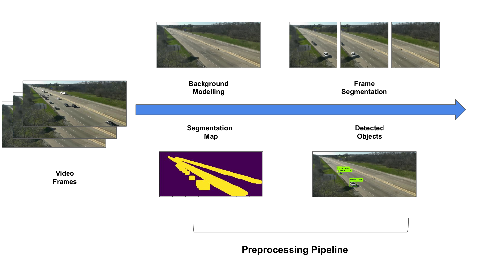
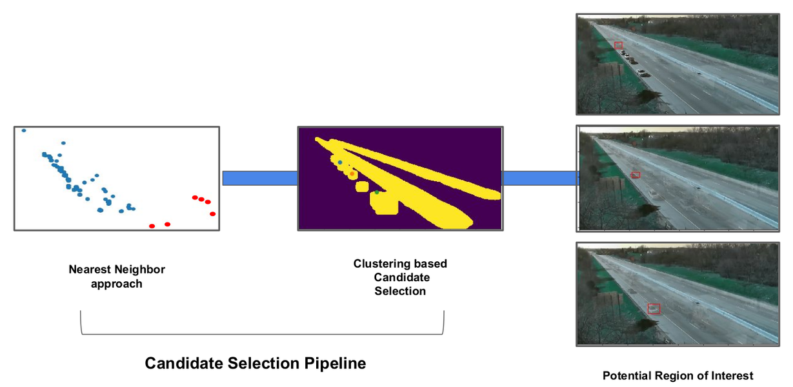
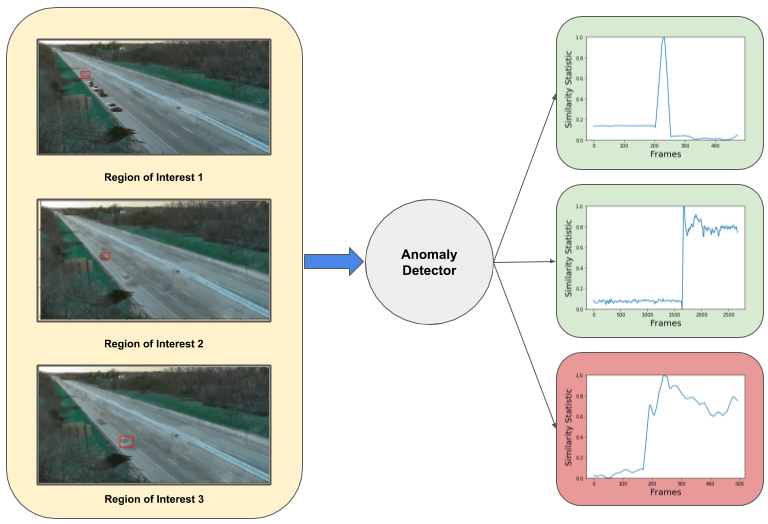

# NVIDIA AICITY CHALLENGE 2020 

🏆 Our team got the second position at the AI CITY 2020 Challenge Track 4.

## Fast Unsupervised Anomaly Detection for Traffic Videos

This repository contains our source code of Track 4 in the NVIDIA AI City Challenge at CVPR 2020. 

### Introduction

#### NVIDIA AICity Challenge 2020 Track 4

The Track 4 of NVIDIA AI CITY 2020 comprised of detecting anomalies based on different video feeds available from multiple cameras at intersections and along highways. 

Detailed information of NVIDIA AICity Challenge 2020 can be found [here](https://www.aicitychallenge.org/).


Overview of the architecture of our anomaly detection framework, which consists of three main pipelines.

### Requirements

1. Python 3.6
2. To run the model from scratch, request data from the organizers.
3. Install Yolo-v3 from [here](https://github.com/AlexeyAB/darknet) and use pretrained model on MS-COCO.

To run model from scratch, please follow these steps:

### Pipeline 1
<p align="center">
  
</p>

-- Background Modelling
1. Run `python extract_frames.py` to extract frames from the videos with frequency set as 100. 
2. Run `python extract_processed.py` to segment the processed images. 
3. Run pretrained Yolo v3 model on the processed_images2 folder and save it as `result.json`.

-- Segmentation Maps
1. Run `python3 extract_frames.py` to extract frames from the videos with frequency set as 10.
2. Run pretrained Yolo v3 model on the original_images folder and save it as `part1.json`. To reduce complexity, we divided the task into two parts and saved it as part1.json and part2.json. 
3. Run `Seg_masks.py`. 
4. Run `python3 Masks/get_ignore_area.py`.
5. Computed Segmentation Masks can be downloaded from [here](https://drive.google.com/file/d/15mcjQx02CQ4sgJ9k4UG718wwPpoGAlS4/view?usp=sharing).

### Pipeline 2
<p align="center">
  
</p>


1. Run `python3 Detector.py` and the results will be saved in `Results.txt`.

### Pipeline 3
<p align="center">
  
</p>

Since it would take a considerable amount of time to run all the steps from scratch, we have also provided precalculated results. You can directly see the result by running 'python3 Detector.py' or see it on the Jupyter notebook `Detector.ipynb`.


### Citation

```
@inproceedings{doshi2020fast,
  title={Fast Unsupervised Anomaly Detection in Traffic Videos},
  author={Doshi, Keval and Yilmaz, Yasin},
  booktitle={Proc. CVPR Workshops, Seattle, WA, USA},
  year={2020}
}

```
